# seccomp-bakk

This project contains the Dockerfiles, setup guides and results for the thesis: "Evaluation of automatically generated Seccomp profiles with regard to preventing exploits".

## Project structure

### Base tools image

These directories contain the Dockerfile for the tools `Binalyzer` and `sysfilter`, which are used as the Base for the applications.

- `Binalyzer/`
- `sysfilter/`

### Application setups

These directories contain the Dockerfile to setup the application, exploits scripts, patches to make the application vulnerable, etc.

- `vsftpd/`
- `httpd/`
- `redis/`

The structure of an application directory is following. In each folder are the tool specific files.

```
[application]/
├── chestnut/
  │ └── README.md <- contain the results & step-by-step instructions
  │ └── ...
└── sysfilter/
  │ └── README.md
  │ └── ...
```

## Installation

Host: 6.14.3-arch1-1

Docker: Docker version 28.0.4

If you want to reproduce the results:

- clone the repo
- run the `build.sh` script in `chestnut/` and `/sysfilter` to get the base images
- run again the `build.sh` in the wanted application e.g. `vsftpd/sysfilter/build.sh`
- do the following for extracting system calls, generating a seccomp policy, applying the policy to the application and running the exploits against the applications

_Binalyzer_


_Sysfilter_



For more details, check the `README.md` for step-by-step instructions.
